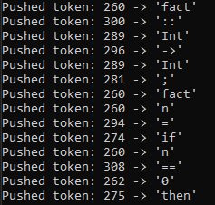
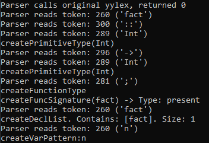
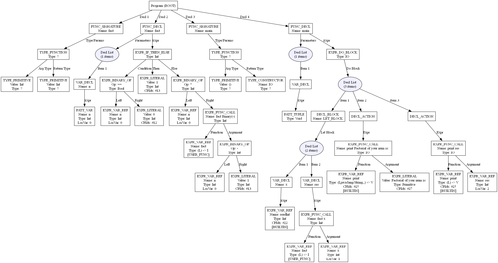
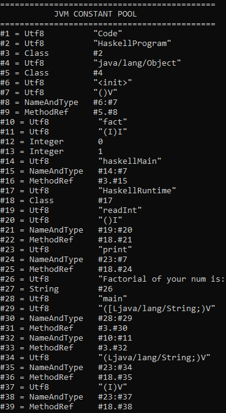
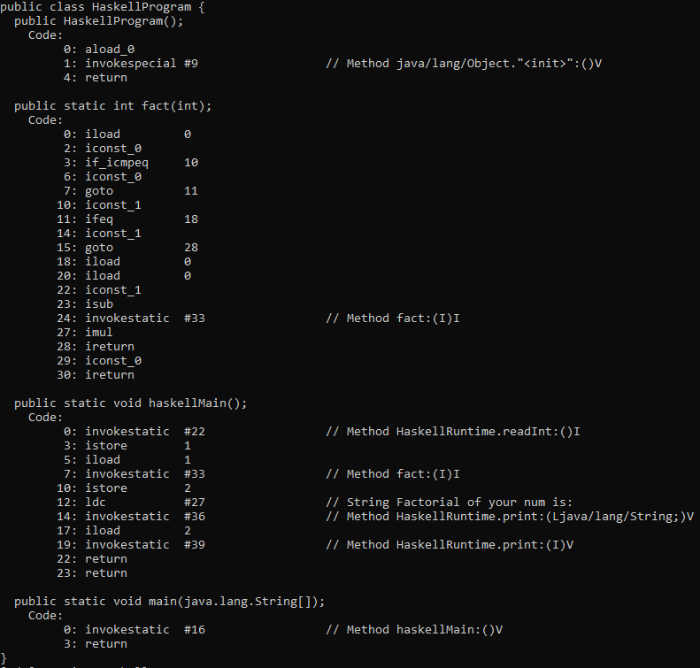
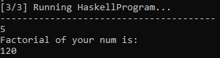

# ghdc

**ghdc** – компилятор упрощённого подмножества Haskell в JVM bytecode.

Компилятор написан на C/C++ и использует Lex/Yacc для построения лексического и синтаксического анализаторов. На выходе формируется JVM-compatible код, который может выполняться на Java Runtime.

Проект реализует полный pipeline компиляции:

```text
Haskell source
      │
      ▼
   Lexer
      │
      ▼
   Parser
      │
      ▼
Semantic Analyzer
      │
      ▼
Code Generator
      │
      ▼
Java Runtime
```

## Возможности

* лексический анализ исходного Haskell-кода на gnu lex;
* синтаксический анализ с помощью gnu yacc;
* построение AST;
* семантический анализ и проверка типов;
* формирование JVM constant pool;
* генерация JVM bytecode;
* сборка JVM class-файла;
* собственный runtime на Java.

## Пример

В качестве наглядного примера используем вычисление факториала.

```haskell
fact :: Int -> Int
fact n = if n == 0 
         then 1 
         else n * fact (n - 1)

main :: () -> IO
main () = do
    let x = readInt
        res = fact x
    print "Factorial of your num is: "
    print res
```

На примере можно проследить весь процесс компиляции от исходного `.hs` файла до выполнения JVM bytecode.

## Пайплайн компиляции

### 1. Исходный код

Файл `fact.hs`:

```haskell
fact :: Int -> Int
fact n = if n == 0 
         then 1 
         else n * fact (n - 1)

main :: () -> IO
main () = do
    let x = readInt
        res = fact x
    print "Factorial of your num is: "
    print res
```

---

### 2. Лексический анализ

На первом этапе исходный код разбивается на последовательность токенов.



(Фрагмент вывода)

Лексер реализован с использованием **Lex**. Сгенерированный `lex.yy.c` входит в исходный код проекта.

---

### 3. Синтаксический анализ

Полученная последовательность токенов передаётся синтаксическому анализатору.

Parser проверяет соответствие программы грамматике языка и формирует структуру программы.



(Фрагмент вывода)

Грамматика находится в `parser.y`, а сгенерированный Yacc/Bison parser представлен файлами `parser.tab.cpp` и `parser.tab.h`.

---

### 4. AST и семантический анализ

После синтаксического анализа программа представляется в виде абстрактного синтаксического дерева.

После построения AST выполняется семантический анализ и атрибутирование дерева.

Также на этом этапе проверяются:

* типы выражений;
* объявления функций;
* аргументы функций;
* возвращаемые значения;
* использование переменных;
* корректность операций;
* соответствие и кастинг типов.



---

### 6. Constant Pool

Перед генерацией JVM bytecode формируется таблица констант класса.

В неё попадают необходимые строки, типы, имена методов, ссылки на классы и другие константы, используемые JVM class file.



В проекте за работу с constant pool отвечают `constant_pool.cpp` и `constant_pool.h`.

---

### 7. JVM Bytecode

После анализа AST компилятор генерирует JVM instructions.

Функция `fact` превращается в последовательность инструкций вида:



На этом этапе исходная программа уже представлена инструкциями JVM.

Генерация кода реализована в `code_generator.cpp`, а формирование отдельных bytecode-инструкций вынесено в `bytecode_emitter.h`.

---

### 8. Выполнение программы

После генерации JVM-класса полученный код запускается через Java runtime.

Для примера:



## Сборка

Для сборки проекта используется отдельный build-файл, который автоматизирует необходимые этапы компиляции.

После клонирования репозитория достаточно выполнить сборку проекта:

```bash
git clone https://github.com/duvean/ghdc.git
cd ghdc

build
```

После успешной сборки появляется исполняемый файл компилятора:

```text
ghdc.exe
```

## Запуск

Компиляция Haskell-файла:

```bash
ghdc.exe file.hs
```

После этого скомпилированную программу можно запустить:

```bash
run
```

Для примера:

```bash
ghdc.exe fact.hs && run
```

## Структура проекта

```text
ghdc/
├── ast.cpp
├── ast.h
│
├── lex.l
├── lex.yy.c
│
├── parser.y
├── parser.tab.cpp
├── parser.tab.h
│
├── semantic_analyzer.cpp
├── semantic_analyzer.h
├── semantic_common.h
├── semantic_type.h
│
├── constant_pool.cpp
├── constant_pool.h
│
├── bytecode_emitter.h
├── code_generator.cpp
├── code_generator.h
│
├── class_builder.cpp
├── class_builder.h
├── jvm_class.h
│
├── token_queue.cpp
├── token_queue.h
│
├── main.cpp
│
└── runtime/
    └── HaskellRuntime.java
```

## Репозиторий

[GitHub — duvean/ghdc](https://github.com/duvean/ghdc)
